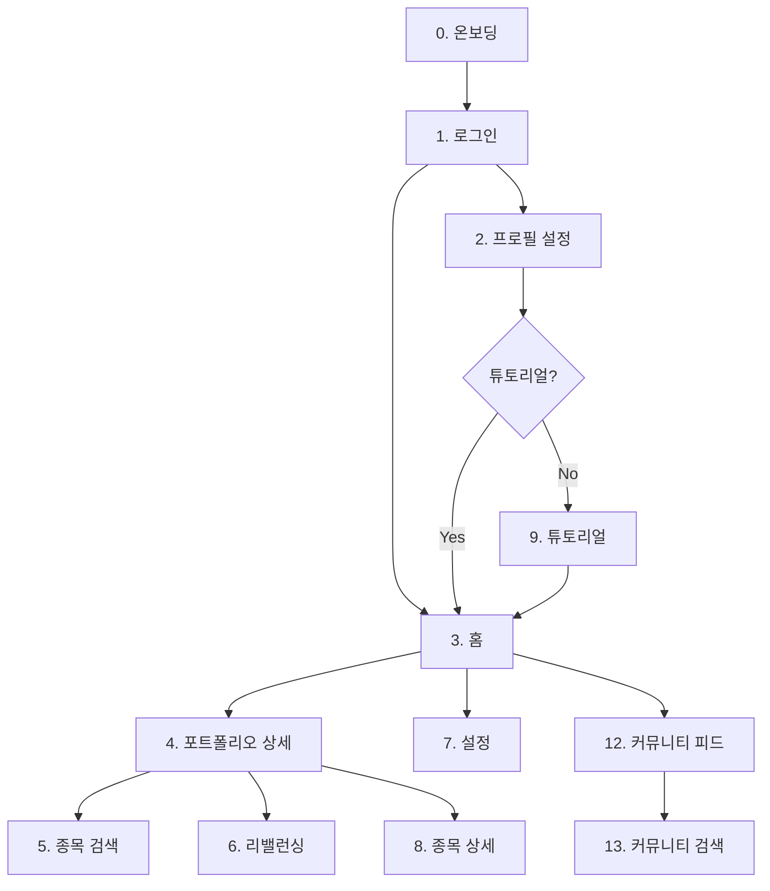

# 페이지 상세 시나리오 인덱스

> **작성일**: 2026-01-14  
> **프로젝트**: Stock-Keeper  
> **용도**: UI/UX 검증용 상세 시나리오

---

## 📌 문서 목적

이 문서들은 **프로토타입 UI/UX 검증**을 위한 상세 시나리오입니다.  
`specs/ui/`의 간결한 스펙과 달리, 와이어프레임, 엣지케이스, 인터랙션 상세를 포함합니다.

> [!NOTE]
> **AI 개발 시에는 `specs/ui/`를 우선 참조**하고, 상세 시나리오가 필요할 때만 이 문서를 참조하세요.

---

## 📑 페이지 목록

| # | 페이지명 | 파일 | Phase | 프로토타입 |
|---|---------|------|-------|-----------|
| S | [스플래시](./11_splash.md) | `11_splash.md` | P1 | ✅ 완료 |
| 0 | [앱 소개 온보딩](./00_onboarding.md) | `00_onboarding.md` | P1 | ✅ 완료 |
| 1 | [로그인/회원가입](./01_login.md) | `01_login.md` | P1 | ✅ 완료 |
| 2 | [프로필 설정](./02_profile.md) | `02_profile.md` | P1 | ✅ 완료 |
| 3 | [홈 (포트폴리오 목록)](./03_home.md) | `03_home.md` | P1 | ✅ 완료 |
| 4 | [포트폴리오 상세](./04_portfolio_detail.md) | `04_portfolio_detail.md` | P1 | ✅ 완료 |
| 5 | [종목 검색/추가](./05_stock_search.md) | `05_stock_search.md` | P1 | ✅ 완료 |
| 6 | [리밸런싱 분석](./06_rebalancing.md) | `06_rebalancing.md` | P1 | ✅ 완료 |
| 7 | [설정](./07_settings.md) | `07_settings.md` | P1 | ✅ 완료 |
| 7-1 | [프로필 편집](./10_profile_edit.md) | `10_profile_edit.md` | P1 | ✅ 완료 |
| 8 | [종목 상세](./08_stock_detail.md) | `08_stock_detail.md` | P2 | ✅ 완료 |
| 9 | [앱 튜토리얼](./09_tutorial.md) | `09_tutorial.md` | P2 | ❌ 미구현 |
| 12 | [커뮤니티 피드](./12_community_feed.md) | `12_community_feed.md` | P2 | ❌ 미구현 |
| 13 | [커뮤니티 검색](./13_community_search.md) | `13_community_search.md` | P2 | ❌ 미구현 |

> **프로토타입 현황**: 12/15 페이지 완료 (2026-01-14 기준)

---

## 🔗 화면 플로우

---

## 📋 각 문서 구성

| 섹션 | 내용 |
|------|------|
| **화면 개요** | 목적, 진입/이동 경로 |
| **와이어프레임** | ASCII 레이아웃 |
| **화면 상태** | Loading, Error, Empty |
| **엣지케이스** | 예외 상황 처리 |
| **체크리스트** | 프로토타입 검증 항목 |

### 체크리스트 표기법

| 표기 | 의미 | 설명 |
|------|------|------|
| `[직접]` | 직접 조작 | 클릭, 입력 등으로 확인 |
| `[패널]` | 패널 제어 | 컨트롤 패널로 상태 토글 |

### Phase 구분

| Phase | 설명 | 프로토타입 |
|-------|------|-----------|
| **P1** | MVP 필수 | ✅ UI + 기능 |
| **P2** | 확장 기능 | ✅ UI만 |
| **P3** | 고도화 | ❌ Placeholder |

---

## 📚 관련 문서

| 문서 | 용도 |
|------|------|
| [specs/ui/](../../specs/ui/) | AI 코드 생성용 간결 스펙 |
| [prototype_v3/README.md](../../../prototype_v3/README.md) | 프로토타입 실행 가이드 |
| [AI_PRD/README.md](../../README.md) | AI_PRD 전체 구조 |

---

> 📅 최종 수정: 2026-01-14
