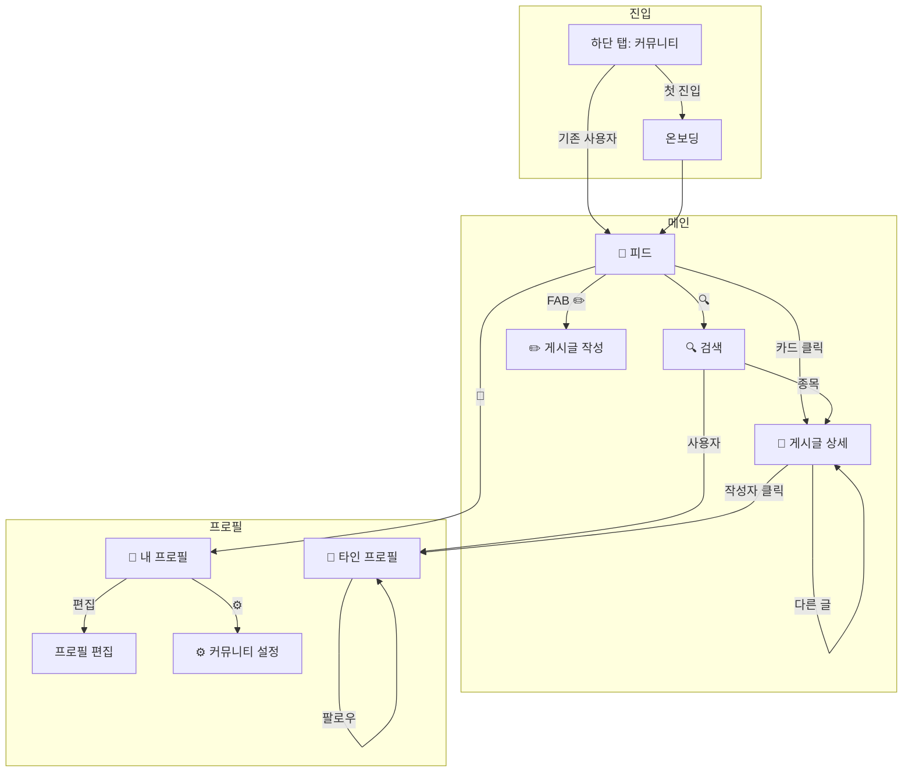

# 커뮤니티 기능 Draft

> **상태**: 논의 중  
> **작성일**: 2026-01-15  
> **참고**: 토스증권 커뮤니티 UX

---

## 📂 문서 구조

| 파일 | 내용 |
|------|------|
| [01_db_schema.md](./01_db_schema.md) | DB 테이블 설계 (community_profiles, blocks, reports, bookmarks) |
| [02_screens.md](./02_screens.md) | 화면 레이아웃 (18개 화면) |
| [03_ui_patterns.md](./03_ui_patterns.md) | UI 패턴 (팔로우, 북마크, 차단, 신고 모달/토스트) |
| [04_decisions.md](./04_decisions.md) | 확정 사항 (닉네임, 글자수, 공개범위, 종목태그 등) |
| [05_todo.md](./05_todo.md) | 미기획/고려사항/다음 단계 |

---

## 📍 페이지 구조

```
커뮤니티/
├── 🚪 온보딩 (첫 진입 시)          → 피드로 이동
│
├── 📰 피드 (메인)                   ← 하단 탭 "커뮤니티"
│   ├── [추천 / 팔로잉 / TBD]       ← 콘텐츠 탭
│   ├── 🔍 검색                      → 검색 화면
│   ├── 👤 내 프로필                 → 내 프로필 화면
│   ├── ✏️ FAB 글쓰기               → 게시글 작성 화면
│   └── 📄 게시글 카드               → 게시글 상세
│
├── 🔍 검색
│   ├── 종목 결과                   → 해당 종목 포함 포트폴리오
│   └── 사용자 결과                 → 타인 프로필
│
├── 📄 게시글 상세
│   ├── 작성자 프로필               → 타인 프로필
│   ├── 이 사람의 다른 글           → 게시글 상세
│   ├── 더보기 메뉴 (타인)          → 북마크/차단/신고
│   ├── 더보기 메뉴 (본인)          → 수정/삭제/북마크
│   └── 댓글 영역
│
├── 👤 내 프로필
│   ├── ⚙️ 설정                     → 커뮤니티 설정
│   ├── 프로필 편집                 → 프로필 편집 화면
│   ├── 팔로워/팔로잉               → 팔로워/팔로잉 목록
│   └── [최근활동 / 투자 / TBD]
│
├── 👥 타인 프로필
│   ├── 🚫 차단                     → 차단 모달
│   ├── 팔로우 버튼                 → 팔로우 바텀시트
│   └── [공개된 탭만 표시]
│
└── ⚙️ 커뮤니티 설정
    ├── 알림 설정
    ├── 정보 공개 범위
    ├── 북마크
    ├── 차단 계정 관리
    ├── 신고·삭제된 글
    └── 커뮤니티 이용규칙
```

---

## 🗺️ 화면 플로우



---

## 🔄 핵심 변경 포인트

### 현재 구조 (문제점)

```
users 테이블 하나에 모든 정보:
├── 앱 기본 정보 (email, google_id, role, membership)
├── 앱 프로필 (nickname, profile_picture)
└── 커뮤니티 정보 (bio, profile_character, is_verified)
```

**문제**: 커뮤니티 비사용자도 커뮤니티 관련 컬럼 보유, 프로필 분리 불가

### 제안 구조

```
users 테이블 (앱 계정) - 기존 유지
├── 기본 정보 (email, google_id)
├── 앱 프로필 (name, profile_picture - Google 연동)
└── 앱 설정 (role, membership, is_active)

community_profiles 테이블 (커뮤니티 전용) [신규]
├── 커뮤니티 닉네임 (닉네임 변경 쿨타임 90일)
├── 커뮤니티 프로필 사진 (별도 업로드)
├── 자기소개 (bio)
├── 공개 설정 / 알림 설정
└── 가입 상태 (약관 동의 여부)
```

---

## 📊 DB 스키마 참조

> **참고**: `01_db_schema.md`에는 **커뮤니티 전용 테이블만** 정의
>
> 기존 테이블(`users`, `posts`, `comments`, `follows`, `likes` 등)은 아래 참조:
>
> - `Docs/AI_PRD/specs/db/` - 테이블별 상세 스펙
> - `TEST/DBML/` - 전체 스키마 다이어그램

---

> 📅 최종 수정: 2026-01-16
