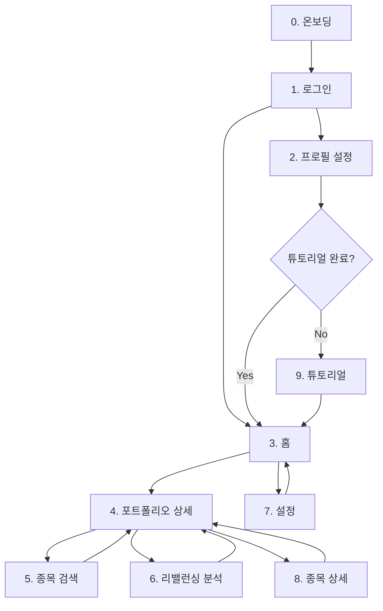

# 화면 기획서 인덱스

> **작성일**: 2026-01-04  
> **프로젝트**: Stock-Keeper  
> **버전**: v1.0 (Phase 1 기준)

## 📌 문서 목적

이 화면 기획서들은 **UI/UX 검증용 프로토타입**을 만들기 위한 설계 문서입니다. 와이어프레임과 인터랙션을 시각적으로 확인하는 것이 주 목적이며, 실제 비즈니스 로직 구현은 포함하지 않습니다.

### 프로토타입 작업 범위

> [!IMPORTANT]
> **프로토타입은 UI/UX 검증만 담당합니다.**
>
> - **화면 테스트**: Phase 2까지 진행 (P1 배포 시점에 P2 화면도 대부분 준비 필요)
> - **기능 개발**: Phase 1까지만 진행
>
> 즉, 프로토타입에서는 P2 화면도 구현하지만, 실제 비즈니스 로직/기능 개발은 P1 범위만 진행합니다.

### 프로토타입 구현 원칙

> [!NOTE]
> **UI 상태 확인이 필요한 경우** (예: 스켈레톤 로딩, Empty State, Error State 등)는 해당 컴포넌트에 직접 로직을 구현하지 않습니다.
>
> 대신, **프레임 바깥의 컨트롤 패널**을 통해 상태를 토글하여 확인할 수 있도록 구현합니다. 구체적인 구현 방법은 [prototype_v3/README.md](../../TEST/prototype_v3/README.md)를 참고하세요.

### 체크리스트 테스트 방식 표기법

각 화면 기획서의 체크리스트에서 **테스트 방식**을 다음과 같이 표기합니다:

| 표기 | 의미 | 설명 | 예시 |
|------|------|------|------|
| `[직접]` | 직접 상호작용 | 클릭, 입력, 스와이프 등 사용자 제스처로 확인 | 버튼 클릭, 모달 열기, 유효성 검사 |
| `[패널]` | 패널 컨트롤 | 컨트롤 패널 버튼으로 상태 토글하여 확인 | Loading, Error, Empty 상태 |

> [!TIP]
>
> - `[직접]`: 실제 앱처럼 상호작용하면 바로 확인 가능
> - `[패널]`: 컨트롤 패널에서 해당 상태 버튼을 눌러 확인

### 체크리스트 Phase 구분

> [!IMPORTANT]
> 각 화면 기획서의 **체크리스트 항목은 기능 구현 Phase 기준**으로 분류됩니다.
>
> | Phase | 설명 | 프로토타입 구현 |
> |-------|------|----------------|
> | **P1** | MVP 필수 기능 | ✅ UI + 기능 |
> | **P2** | 개선/확장 기능 | ✅ UI만 (기능 미구현) |
> | **P3** | 고도화 기능 | ❌ Placeholder 또는 미구현 |
>
> 프로토타입에서는 **P2까지 UI를 구현**하되, 실제 기능 개발은 P1 범위만 진행합니다.

---

## 📑 화면 목록

| #  | 화면명 | 파일 | 우선순위 | 문서 상태 | 구현 상태 |
|----|-------|------|---------|---------|----------|
| S  | [스플래시](./11_splash.md) | `11_splash.md` | P1 | ✅ 작성완료 | ✅ **구현완료** |
| 0  | [앱 소개 온보딩](./00_onboarding.md) | `00_onboarding.md` | P1 | ✅ 작성완료 | ✅ **구현완료** |
| 1  | [로그인/회원가입](./01_login.md) | `01_login.md` | P1 | ✅ 분석완료 | ✅ **구현완료** |
| 2  | [프로필 설정](./02_profile.md) | `02_profile.md` | P1 | ✅ 분석완료 | ✅ **구현완료** |
| 3  | [홈 (포트폴리오 목록)](./03_home.md) | `03_home.md` | P1 | ✅ 분석완료 | ✅ **구현완료** |
| 4  | [포트폴리오 상세](./04_portfolio_detail.md) | `04_portfolio_detail.md` | P1 | ✅ 분석완료 | ✅ **구현완료** |
| 5  | [종목 검색/추가](./05_stock_search.md) | `05_stock_search.md` | P1 | ✅ 분석완료 | ✅ **구현완료** |
| 6  | [리밸런싱 분석](./06_rebalancing.md) | `06_rebalancing.md` | P1 ⭐ | ✅ 분석완료 | ✅ **구현완료** |
| 7  | [설정](./07_settings.md) | `07_settings.md` | P1 | ✅ 분석완료 | ✅ **구현완료** |
| 7-1| [프로필 편집](./10_profile_edit.md) | `10_profile_edit.md` | P1 | ✅ 작성완료 | ✅ **구현완료** |
| 8  | [종목 상세](./08_stock_detail.md) | `08_stock_detail.md` | P2 | ✅ 작성완료 | ✅ **구현완료** |
| 9  | [앱 튜토리얼](./09_tutorial.md) | `09_tutorial.md` | P2 | 🆕 작성완료 | ❌ 미구현 |

> **Prototype V3 구현 현황**: 12/13 화면 완료 (2026-01-13 기준)

---

## 🔗 화면 플로우

---

## 📋 각 문서에 포함된 내용

- **화면 개요**: 목적, 진입 경로, 이동 가능 화면
- **사용자 스토리**: 핵심 니즈 정의
- **현재 구현 요소**: ASCII 와이어프레임으로 시각화
- **개선 아이디어**: 상세 제안 및 옵션 비교
- **엣지 케이스**: 에러 상태, Empty State 등
- **화면 상태**: Loading, Error, Success 등
- **체크리스트**: MVP vs Phase 2 구분

---

## 📚 관련 문서

- [prototype_page_analysis.md](../prototype_page_analysis.md) - 전체 요약
- [ux_design_recommendations.md](../ux_design_recommendations.md) - UX 디자인 가이드
- [screen_flow.md](../screen_flow.md) - 화면 플로우

---

## 📝 용어 정리

| 용어 | 영문 | 설명 |
|-----|------|------|
| **화면 기획서** | Screen Specification | 개별 화면의 상세 설계 문서 |
| **와이어프레임** | Wireframe | 레이아웃 스케치 |
| **유저 플로우** | User Flow | 사용자 이동 경로 |
| **인터랙션 명세** | Interaction Spec | 동작/애니메이션 정의 |

---

> **다음 단계**:
>
> 1. 각 화면 기획서의 개선 아이디어 검토
> 2. 우선순위 결정
> 3. Figma 와이어프레임 작업
